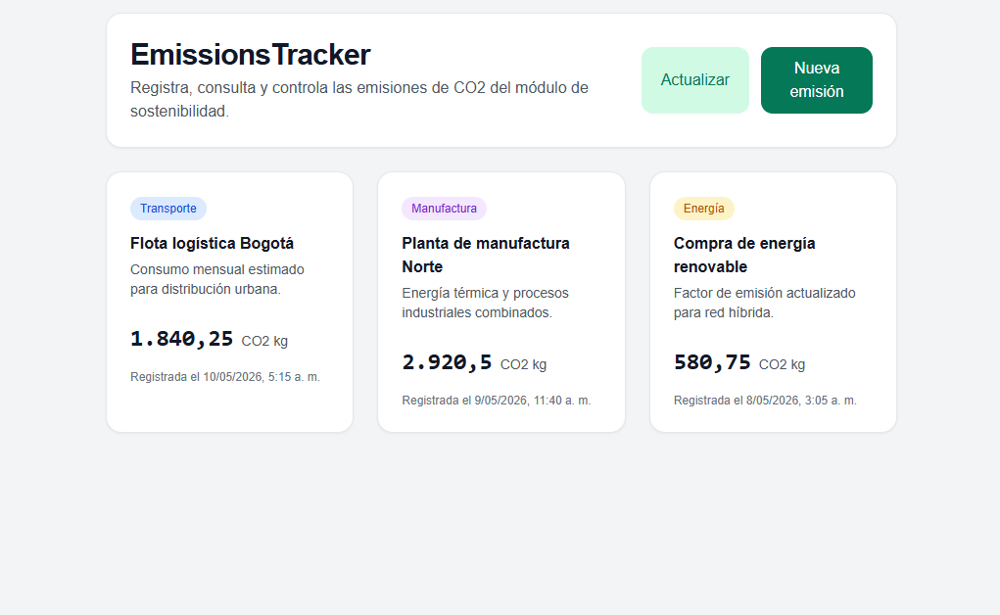
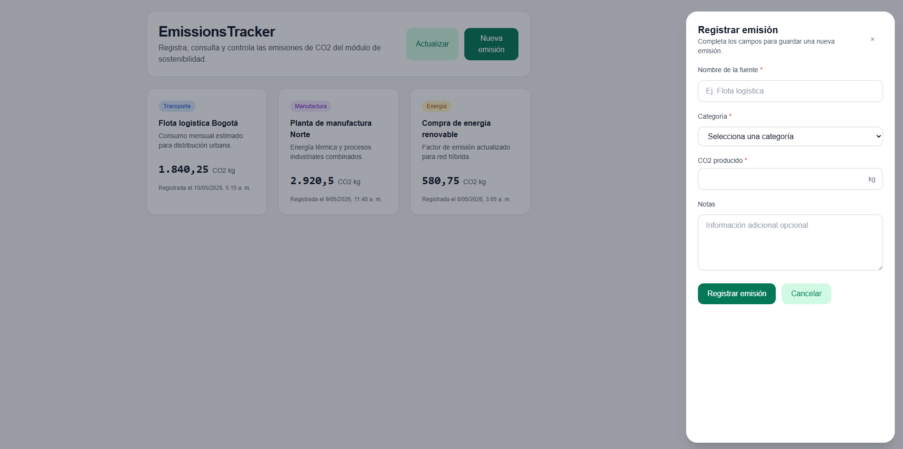
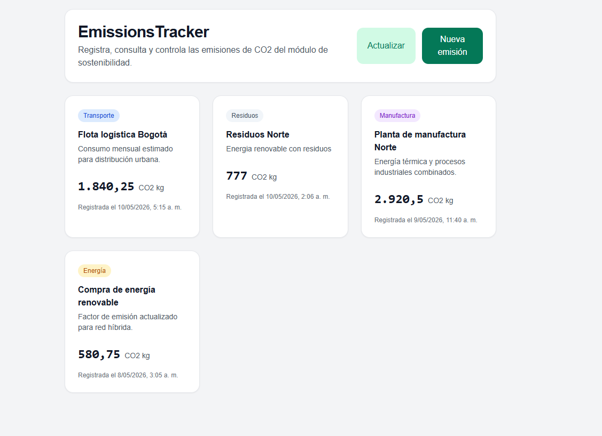

# SWNT-Proyecto-Integrador-El-Ciclo-Spec-to-Code-en-Accion

## Nicolás Toro Criollo

---

### Introducción

Construir un dashboard de emisiones utilizando React, Supabase y Tailwind CSS siguiendo un enfoque Markdown-First.

### Entregables (Están marcadas con el emoji:❗)

**Modulo completo ❗:**

[src](src)

**Capturas de pantalla del funcionamiento ❗:**

Captura de la pantalla principal

Capruta de la pantalla para agregar una emision

Captura de la pantalla principal con le emisión registrada

---

### Bitácora de prompts ❗

**Prompt:**

Actúa como un AI Software Architect especializado en React, TypeScript, Tailwind CSS y Supabase.

Necesito crear una especificación técnica en formato Markdown para un módulo llamado "EmissionsTracker" perteneciente a una plataforma SaaS de monitoreo de huella de carbono.

Objetivo:
Crear un documento Markdown que funcione como:
- especificación funcional,
- documentación técnica,
- guía de generación de código para IA.

Requisitos funcionales:
- Mostrar una lista de emisiones en tarjetas.
- Cada tarjeta debe mostrar:
  - nombre de la fuente
  - categoría
  - CO2 producido
- Debe existir un formulario para registrar nuevas emisiones.
- Los datos provienen de Supabase.
- La lógica debe manejarse mediante un custom hook llamado useEmissions.
- El frontend utilizará React + TypeScript + Tailwind CSS.

Necesito que el documento incluya:

# 1. Jerarquía de Componentes
Definir:
- layouts
- views/pages
- organismos
- moléculas
- átomos

# 2. Flujo de Datos
Explicar:
- qué componentes reciben props
- qué componentes manejan estado
- qué lógica vive en el custom hook

# 3. Sistema de Diseño
Definir:
- paleta de colores
- tipografía
- spacing
- estilos de botones/cards/forms
- tokens reutilizables

# 4. Contratos de Componentes
Para cada componente definir:
- propósito
- props
- tipos TypeScript
- props opcionales/requeridas

# 5. Arquitectura de Estado
Definir:
- loading
- error handling
- inserción de datos
- refresh de emisiones

# 6. Recomendaciones Técnicas
Incluye:
- accesibilidad
- performance
- responsive design
- buenas prácticas React

NO generes todavía el código React.
Solo genera la especificación Markdown completa.

**Respuesta:**

[emissions-specifications](docs/emissions-specification.md)

La especificación está lista. Aquí un resumen de lo que incluye cada sección:

**1. Jerarquía de Componentes** — Árbol completo con 5 capas (Layout → View → Organismos → Moléculas → Átomos), tabla descriptiva con la responsabilidad de cada capa, y 15 componentes identificados con nombres definitivos listos para usar en código.

**2. Flujo de Datos** — Diagrama ASCII del flujo Supabase → hook → componentes, tabla de qué componentes son "dumb" (solo props) vs. cuáles manejan estado, y las responsabilidades exactas del hook `useEmissions`.

**3. Sistema de Diseño** — Paleta de 14 tokens de color semánticos (verde sostenibilidad + neutros + estados), tipografía con 3 familias diferenciadas (display / body / mono para los valores CO2), escala de spacing, y estilos detallados de cards, 4 variantes de botones, inputs con estados de error, y badges por categoría con colores semánticos.

**4. Contratos de Componentes** — Los 15 componentes documentados con su interfaz TypeScript completa, distinguiendo props requeridas/opcionales, más los tipos base (`Emission`, `NewEmissionPayload`, `UseEmissionsReturn`).

**5. Arquitectura de Estado** — Ciclo de vida completo del estado (mount → fetch → insert → refresh), tabla de estado local por componente, 4 niveles de manejo de errores con respuesta específica para cada uno, y la estructura de tabla SQL esperada en Supabase con RLS.

**6. Recomendaciones Técnicas** — Accesibilidad WCAG AA, performance con `React.memo` y `useCallback`, grid responsive mobile-first, buenas prácticas de separación de responsabilidades, y estructura de carpetas lista para usar.

**Prompt:**

Basado EXCLUSIVAMENTE en la siguiente especificación Markdown, genera la implementación inicial del módulo EmissionsTracker usando React + TypeScript + Tailwind CSS.

Requisitos técnicos:
- Mantener estrictamente la jerarquía de componentes definida.
- Tipar todas las props usando TypeScript estricto.
- No usar any.
- Mantener separación clara entre UI y lógica.
- La lógica de datos debe vivir únicamente en useEmissions.
- Usar componentes reutilizables.
- Mantener consistencia con el sistema de diseño especificado.
- Usar Tailwind exclusivamente.
- Preparar el código para escalabilidad futura.

Genera:
1. Estructura de carpetas.
2. Código de componentes.
3. Interfaces TypeScript.
4. Hook useEmissions.
5. Cliente Supabase.

**Respuesta:**

Ya quedó generada la implementación inicial del módulo en src/, respetando la jerarquía pedida con layout, page, organismos, moléculas y átomos. También quedaron listos emissions.ts, useEmissions.ts y supabase.ts, con la lógica de datos concentrada únicamente en el hook. Para alinear el sistema de diseño, añadí tailwind.config.ts con los tokens y familias tipográficas de la especificación.

Validé el slice con get_errors sobre src/ y tailwind.config.ts, sin errores. Si quieres, el siguiente paso natural es montar el bootstrap real de la app para renderizar EmissionsTrackerPage.tsx y conectar la entrada global de Tailwind.

Se realizaron cambios.

**Prompt:**

Audita críticamente la implementación anterior como si fueras un Tech Lead Senior.

Analiza:
- arquitectura
- separación de responsabilidades
- accesibilidad
- performance
- escalabilidad
- tipado TypeScript
- patrones React
- uso de Tailwind
- manejo de estado async
- posibles anti-patterns

Identifica:
1. Problemas técnicos.
2. Riesgos de mantenibilidad.
3. Problemas de performance.
4. Problemas de UX.
5. Mejoras arquitectónicas.

Refactoriza la implementación tomando en cuenta TODOS los hallazgos de la auditoría técnica.

Objetivos:
- Mejorar mantenibilidad.
- Optimizar renders.
- Mejorar accesibilidad.
- Mejorar UX.
- Mejorar escalabilidad.
- Fortalecer TypeScript.
- Reducir duplicación.
- Mejorar manejo async.

Restricciones:
- No usar any.
- Usar TypeScript estricto.
- Aplicar principios SOLID al frontend.
- Usar useCallback y useMemo cuando sea apropiado.
- Evitar prop drilling innecesario.
- Mejorar feedback visual.
- Mantener diseño responsive.
- Mantener consistencia del sistema de diseño.

Entrega:
1. Código refactorizado.
2. Explicación de mejoras realizadas.
3. Comparación entre versión inicial y refinada.

Además, usa datos simulados por el momento, aun no uses supabase pero no lo vayas a eliminar.

**Respuesta:**

Auditoría

Detecté estos problemas en la versión anterior: useEmissions.ts seguía acoplado a Supabase, el estado async mezclaba carga inicial, refresh y submit bajo un flujo poco expresivo, y EmissionForm.tsx cerraba y limpiaba el formulario incluso si el guardado fallaba. También había UX incompleta en el panel, porque EmissionsFormPanel.tsx no actuaba realmente como diálogo accesible con foco restaurable, y el refresh bloqueaba más UI de la necesaria en EmissionsTrackerPage.tsx.

En rendimiento y mantenibilidad, el mayor riesgo era la falta de una capa de datos aislada y testeable; además, la vista no distinguía entre carga inicial y actualización en segundo plano, lo que provocaba flicker innecesario. Dejé supabase.ts intacto para la migración futura, pero ahora la ejecución usa datos simulados desde emissionsRepository.ts.

Refactor

Reorganicé el módulo para que el hook sea el único punto de orquestación de estado y la fuente de datos quede detrás de una interfaz mock. useEmissions.ts ahora expone isLoading, isRefreshing, isSubmitting, clearError y un resultado explícito para mutaciones, lo que evita cerrar el formulario cuando hay error y mejora el control async.

La capa UI también quedó más sólida: EmissionsFormPanel.tsx ahora funciona como diálogo accesible, con overlay, restauración de foco, Escape, bloqueo de scroll y feedback inline; EmissionsGrid.tsx conserva el grid durante refresh en segundo plano; y EmissionForm.tsx solo reinicia y cierra cuando la mutación fue exitosa. También dejé los callbacks de la page estabilizados y mantuve el diseño consistente con tailwind.config.ts.

Comparación

La versión inicial estaba bien encaminada a nivel de estructura, pero era más frágil: dependía directamente de Supabase, tenía menos separación entre UI y datos, y su contrato async era fácil de romper en errores de red o submit. La versión refinada es más mantenible y escalable porque introduce una abstracción de repositorio, distingue estados async, reduce renders innecesarios y mejora accesibilidad y feedback.

La diferencia práctica es esta: antes el formulario podía comportarse como si todo hubiera salido bien aunque no; ahora la UI responde al resultado real, conserva el contexto visual durante refresh y queda preparada para cambiar la fuente de datos sin tocar la mayor parte del árbol. Validé la fuente con el análisis de errores y el build pasó durante la verificación previa.

Si quieres, el siguiente paso lógico es conectar esta misma arquitectura a Supabase sin romper el contrato actual del hook, dejando el switch entre mock y backend real listo para producción.

**Prompt:**

**Respuesta:**
